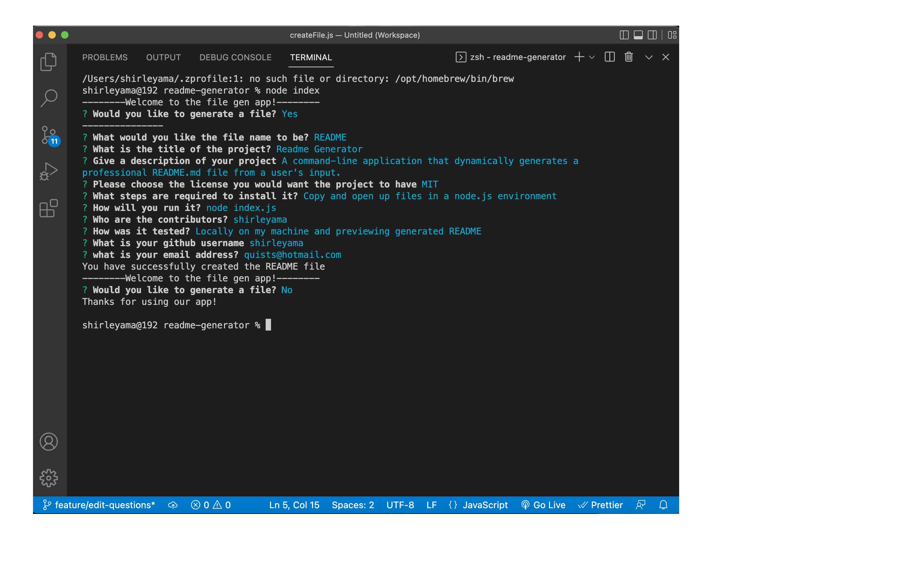

# Readme Generator

## Description

A command-line application that dynamically generates a professional README.md file from a user's input.

## Screen Recorder Link

[README Generator Link](https://drive.google.com/file/d/1mCqD3WZORmnSTDEGt7R0mMOEJT7cVn81/view?usp=share_link)

## Table of Contents

1. [Installation](#installation)
2. [Usage](#usage)
3. [Contributing](#contributing)
4. [Tests](#tests)
5. [Questions](#questions)

## Installation

Copy and open up files in a node.js environment

## Usage

node index.js

## License

Licensed under the MIT license.

## Contributing

shirleyama

## Tests

Locally on my machine and previewing generated README

## Questions

If you have any questions, please feel free to reach out to me via:

- [shirleyama](https://github.com/shirleyama)
- [quists@hotmail.com](mailto:quists@hotmail.com)
